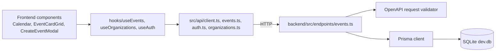

# Changes by Michael Boulerice Since Your Last Commit

**Base:** `98de7cec` (marcus-wrrn, "refactor: added comment", 2026-08-02 19:54:53 -04:00)
**Head:** `64f4d981` (2026-08-03 22:29:32 +00:00)
**Scope:** All 9 commits authored by Michael Boulerice in this range. One intervening commit by Shanel Wu (`167bdff`, "docs: ran eslint and cleaned up generally") is not covered here.

Overall diff (Michael's commits combined, excluding lockfiles): **72 files changed, 1,947 insertions(+), 7,561 deletions(-)**. The deletion count is dominated by removing `frontend/package-lock.json` (6,940 lines) as part of the workspace restructuring below.

---

## Architectural changes

1. **Monorepo workspace restructuring** (`edb4023`) — Introduced `packages/eslint-config` and `packages/typescript-config` as shared, independently-versioned workspace packages. Every workspace (`backend`, `frontend`) now declares its own dependencies explicitly rather than relying on hoisting/implicit sharing from the root. Root `package.json`, `eslint.config.mjs`, and both `tsconfig*.json` files were rewired to consume these shared configs. A committed `frontend/ESLINT_OUTPUT.html` (864 lines) was deleted and `.gitignore` extended to keep monorepo/report artifacts out going forward.

2. **Backend models → utils consolidation** (`642c1a7`) — Deleted the unused `backend/src/models/CommonsFabricUser.ts` (dead model, 62 lines) and moved `constraints.ts` and `orgTags.ts` from `models/` into `utils/`, dissolving the `models/` directory entirely. This also removed an api-contract test whose premises no longer held now that the OpenAPI validator is registered ahead of all routers and every served route is documented in `openapi.yaml`.

3. **Frontend API client relocation** (`9387537`) — Moved the API client and `auth.ts` from `frontend/src/utils/api/` to `frontend/src/api/`, promoting it to a top-level sibling of `mocks/` rather than nesting it under generic `utils/`. Rationale documented in the commit: `utils/` is for dependency-free helpers (datetime, types), not for the subsystem owning the network boundary. Added `frontend/src/api/README.md` describing conventions (relative paths only, no state/error interpretation in these functions).

4. **Event model simplification: dropped `endsAt`** (`dcc1bfb`, breaking API change) — Removed the event end-time field end-to-end: Prisma schema, DBML schema, OpenAPI spec, `events.ts` endpoint, and seed data. Required a hand-written migration (not a plain `DROP COLUMN`) because SQLite refuses to drop a column referenced by a CHECK constraint (`ends_at > starts_at`), so the constraint was dropped and recreated. Contract tests for the old inverted-interval behavior were replaced with tests asserting `endsAt` is now rejected on input.

5. **Real backend wiring replacing mocks** — Progressive replacement of the frontend's mock data layer with real API calls:
   - `f00cffd`: implemented `POST /events` server-side, gated behind session auth.
   - `a47e9c8`: wired frontend auth (login/create-account/logout) to the real API instead of `mocks/auth.ts`.
   - `2ce9ff7`: added `useEvents`/`useOrganizations` hooks fetching from the real API, feeding `Calendar`, `EventCardGrid`, `EventDetailModal`, `EventCard`, `OrgCard`, and the `directory`/`index` routes.
   - `dc64bf1`: wired the create-event modal to actually publish (`POST /events`) via `useEvents`, with cache invalidation across all cached date windows on create.

**Diagram — data flow after this range:**

---

## Timeline

| Timestamp (UTC) | Commit | Summary |
|---|---|---|
| 2026-08-03 17:25 | `edb4023` | Make every workspace declare its own dependencies (introduces `packages/eslint-config`, `packages/typescript-config`) |
| 2026-08-03 17:26 | `642c1a7` | Move `backend/src/models` into `utils`, drop dead `CommonsFabricUser` model |
| 2026-08-03 18:55 | `f00cffd` | Implement `POST /events`, behind a declared session requirement |
| 2026-08-03 18:55 | `a47e9c8` | Wire frontend authentication to the real API |
| 2026-08-03 19:14 | `9387537` | Move the frontend API client into `src/api` |
| 2026-08-03 22:27 | `dcc1bfb` | **Breaking:** drop the event end time (`endsAt`) |
| 2026-08-03 22:28 | `2ce9ff7` | Fetch events and organizations from the API (replace mocks in UI) |
| 2026-08-03 22:29 | `dc64bf1` | Publish events from the create-event modal (real `POST /events`) |
| 2026-08-03 22:29 | `64f4d98` | Refresh dev seed events to current dates (DST-aware offsets) |

All nine commits are co-authored with `Claude Opus 5 <noreply@anthropic.com>`.

---

## Backend changes

| File | Change |
|---|---|
| `backend/src/endpoints/events.ts` | Implemented `POST /events` behind session auth; removed `endsAt` handling; set `allowReserved` on timestamp query params so RFC 3339 colons in `startDate`/`endDate` don't 400 (axios doesn't percent-encode them); a session naming a deleted user now answers 401 instead of 501 |
| `backend/src/models/CommonsFabricUser.ts` | Deleted (dead code) |
| `backend/src/{models → utils}/constraints.ts`, `orgTags.ts` | Relocated |
| `backend/src/docs/api/openapi.yaml` | Documented `POST /events`; removed `endsAt` from the Event schema |
| `backend/src/docs/db/schema.dbml` | Removed `ends_at` column/CHECK |
| `backend/prisma/schema.prisma` | Removed `endsAt` field |
| `backend/prisma/migrations/.../migration.sql` | New 58-line migration: drop-and-recreate the CHECK constraint tied to `ends_at`, since SQLite can't `DROP COLUMN` under a dependent CHECK |
| `backend/prisma/seed/seed.ts` | Removed `endsAt` from seed generation |
| `backend/prisma/seed/dev-organizations-seed.json` | Regenerated dev event dates to be current relative to today, DST-aware (240 lines changed) |
| `backend/src/utils/problems.ts` | Minor adjustment tied to the `endsAt` removal |
| `backend/test/api-contract.test.ts` | Added tests for `POST /events`; replaced old inverted-interval test with tests asserting `endsAt` is rejected on input and the query-window rule is unchanged; removed the now-invalid `/users` validator-bypass test |
| `backend/test/schema-sync.test.ts` | Updated for the `models` → `utils` move |
| `backend/package.json`, `backend/eslint.config.js`, `backend/tsconfig.json`, `backend/src/app.ts` | Updated to declare own dependencies and consume shared `packages/*` configs |

## Frontend changes

| File | Change |
|---|---|
| `frontend/src/api/client.ts`, `auth.ts` | Relocated from `utils/api/` to `api/`; `client.ts` is the shared fetch wrapper |
| `frontend/src/api/events.ts`, `organizations.ts` | New — real API calls for events/orgs (96 and 15 lines) |
| `frontend/src/api/README.md` | New — documents conventions (relative paths, no error interpretation in API layer) |
| `frontend/src/hooks/useAuth.tsx` | Rewired to call the real API instead of `mocks/auth.ts`; also fixes a pre-existing unhandled rejection in `LoginForm` (wrong password rejected into nothing) |
| `frontend/src/hooks/useEvents.ts` | New — fetch + publish events via the API; cache invalidation spans all cached date windows on create, not just the visible one |
| `frontend/src/hooks/useOrganizations.ts` | New — fetch organizations via the API |
| `frontend/src/components/modals/CreateEventModal.tsx` | Wired to publish via `useEvents`; surfaces the API's own validation error text instead of a generic message |
| `frontend/src/components/modals/CreateAccountModal.tsx`, `LoginForm.tsx` | Wired to real auth API |
| `frontend/src/components/nav/Header.tsx` | Updated for real auth state |
| `frontend/src/components/views/Calendar.tsx`, `EventCardGrid.tsx` | Now consume `useEvents`/`useOrganizations` instead of mocks |
| `frontend/src/components/cards/EventCard.tsx`, `OrgCard.tsx` | Adjusted for real API data shape |
| `frontend/src/components/modals/EventDetailModal.tsx` | Adjusted for real API data shape |
| `frontend/src/routes/index.tsx`, `directory.tsx` | Wired to hooks; `index.tsx` jumps the calendar to a newly published event's day |
| `frontend/src/mocks/auth.ts`, `events.ts`, `orgs.ts` | Retained but no longer the primary data source; adjusted where types changed |
| `frontend/src/utils/types/events.ts` | Removed `endsAt` from the `Event` type; other shape adjustments |
| `frontend/src/utils/types/orgs.ts`, `users.ts` | Adjusted for API response shapes |
| `frontend/src/utils/datetime.ts` | Extended (47 lines) to support the new date-window fetching logic |
| `frontend/src/main.tsx` | Query client / provider wiring for the new hooks |
| `frontend/package.json`, `package-lock.json` | Now declares its own dependencies directly (lockfile regenerated, hence the large deletion count) |
| `frontend/tsconfig.app.json`, `tsconfig.node.json`, `vite.config.ts` | Updated to consume `packages/typescript-config` |
| `frontend/eslint.config.js` | Updated to consume `packages/eslint-config` |
| Storybook/docs files (`docs.*.tsx`, `Calendar.mdx`, `.storybook/preview.tsx`) | Updated to match component/prop changes above |

## Root / tooling changes

| File | Change |
|---|---|
| `package.json` (root) | Workspace dependency declarations reworked |
| `eslint.config.mjs` (root) | Delegates to new `packages/eslint-config` |
| `packages/eslint-config/*` | New shared package (`index.mjs`, `package.json`, `README.md`) |
| `packages/typescript-config/*` | New shared package (`base.json`, `node.json`, `vite.json`, `package.json`, `README.md`) |
| `packages/README.md` | New — explains the shared-package convention |
| `.gitignore` | Extended for monorepo/report artifacts |
| `README.md` (root) | Minor update |

---

## Coverage

Read closely: all 9 commit diffs and their commit messages in full. Diff stats were read for every file touched; file contents were not individually re-read outside the diffs/commit messages themselves (i.e., this report trusts the diffs and Michael's own commit-message rationale rather than independently re-verifying runtime behavior). The intervening Shanel Wu commit (`167bdff`) was identified but intentionally excluded per the report's scope (changes by Michael only).
